<a href="https://govtechbuilders.me">
  <picture>
    <source media="(prefers-color-scheme: dark)" srcset="assets/banner-dark.svg">
    <source media="(prefers-color-scheme: light)" srcset="assets/banner-light.svg">
    
  </picture>
</a>

  
  
  

 

I build software for the places where trust breaks down: **public tenders, savings groups, school records and climate payouts.** Most of what I ship shares the same DNA: an append-only, hash-chained audit trail, M-Pesa as the payment rail, offline-first clients for patchy networks, and a human in the loop wherever money moves.

- 🏛️ **CEO, [GovTech Builders KE](https://govtechbuilders.me)**: civic and procurement technology for Kenya
- 📊 **Microsoft Certified: Fabric Data Engineer Associate (DP-700)** ([Verify Credential ↗](https://learn.microsoft.com/users/me/credentials) · ID `54D84D9DA7A2F082`)
- 🚀 **Founder, [VeriBid](https://veribid.app)**: B2B e-procurement with sealed bids and a verifiable audit chain
- 🔭 **Now:** building enterprise Fabric Lakehouses for D365 ERP, shipping DigiShule (EduOne) and testing BlueProof

 

## ◆ Featured work

<table>
<tr>
<td colspan="2" width="100%" valign="top">

### ⚡ Microsoft Fabric Medallion Lakehouse for Dynamics 365 ERP &nbsp;`Data Engineering` · `Production`
**Enterprise Lakehouse for ERP reporting.** Connects Dynamics 365 / Dataverse to Microsoft Fabric OneLake with zero-copy shortcuts. Ingests raw Delta tables into Bronze, uses PySpark to decode cryptic option sets, standardizes EAT timezones and currencies into Silver, and curates a Gold dimensional star schema (`FactSales`, `FactGeneralLedger`, `DimCustomer`, `DimDate`) with Delta Z-Ordering. Powers executive Power BI reporting in **Direct Lake Mode** with sub-second queries and zero refresh timeouts.

Microsoft Fabric · OneLake · PySpark · Delta Lake · Power BI Direct Lake · KQL Eventhouse 
<a href="https://github.com/KabuorJnr/fabric-d365-medallion-lakehouse">Repository ↗</a>

</td>
</tr>
<tr>
<td width="50%" valign="top">

### 🧾 VeriBid &nbsp;`SaaS` · `Live`
**Verified procurement, trusted results.** Contractors submit bids that are encrypted with AES-256 and can't be opened before the tender closes. Every action is written to a SHA-256 chained log that MySQL triggers protect from edits. Four RBAC roles, from company admin to read-only auditor, plus Power BI Embedded analytics.

Next.js 14 · TypeScript · Laravel 11 · MySQL · Power BI 
<a href="https://veribid.app">veribid.app ↗</a> &nbsp;·&nbsp; 🔒 private repo

</td>
<td width="50%" valign="top">

### 🌿 BlueProof &nbsp;`Climate` · `Pre-pilot`
**Cheap proof for mangrove restoration.** A community monitor photographs a plot. A vision model answers a few bounded questions about it, and a deterministic gate checks GPS, duplicate photos and payout frequency. When every check passes, the monitor gets paid over M-Pesa B2C. When one fails, a person reviews the photo. Sentinel-2 NDVI backs this up at hectare scale. The full design is written up in a paper.

Python · Vision LLM · Sentinel-2 · M-Pesa B2C · Hash-chained ledger 
<a href="https://github.com/KabuorJnr/BlueProof">Repository ↗</a>

</td>
</tr>
<tr>
<td width="50%" valign="top">

### 🎓 DigiShule / EduOne &nbsp;`EdTech` · `Active`
**Offline-first school management.** Separate portals for the principal, registrar, finance, teachers, students and parents. Covers attendance, CBC-aligned grading with PDF report cards, fees, discipline and SMS notices. It's a PWA with IndexedDB caching and background sync, running on Supabase with strict Row Level Security. Ships as an Android app.

React · Vite · Supabase · PostgreSQL RLS · Capacitor 
<a href="https://edu1app.tech">Website ↗</a>

</td>
<td width="50%" valign="top">

### 🔵 ChamaOne &nbsp;`Fintech` · `Mobile`
**A Chama manager built so money disputes don't end the group.** Contributions come in by M-Pesa STK push and reconcile automatically. Members vote on loans inside the app, meetings run with digital motions and Jitsi links, and every entry lands in a tamper-evident ledger. Built on the same native shell as EduOne and packaged as an Android APK.

React · Capacitor 8 · Supabase · M-Pesa Daraja 
<a href="https://github.com/KabuorJnr/ChamaOne">Repository ↗</a>

</td>
</tr>
<tr>
<td width="50%" valign="top">

### ⚖️ Transparent Tenders Kenya &nbsp;`GovTech` · `Prototype`
**One e-procurement portal for all 47 counties and the national government.** Fraud heuristics flag shared directors, inflated prices, repeat winners and bid collusion. A SHA-256 ledger records every tender, bid, award and payment, and open JSON APIs let citizens, journalists and oversight bodies check the data themselves.

Node.js · Express · sql.js · Helmet · rate limiting 
<a href="https://github.com/KabuorJnr/ttk">Repository ↗</a>

</td>
<td width="50%" valign="top">

### 🏗️ BuildFlow &nbsp;`Construction` · `Active`
**Contractor and site management.** When an expense is approved, the matching ledger debit is posted in the same transaction. Budget and actual spend are tracked per project, and the React Native field app syncs offline with idempotent retries. Runs on FastAPI in front of Supabase Postgres through the Supavisor pooler. Daraja B2C and KRA eTIMS come in phase 2.

FastAPI · SQLAlchemy async · Supabase · React Native 
🔒 private repo

</td>
</tr>
</table>

 

## ◆ More builds

| Project | What it is | Stack |
|---|---|---|
| 🏟️ **[Stadi](https://github.com/KabuorJnr/stadi)** | Stadium ticketing for Kenyan venues: interactive seat map, M-Pesa checkout, USSD access, QR gate scanning | Laravel 11 · PWA · M-Pesa |
| 🤝 **[ComradeConnect](https://github.com/KabuorJnr/comrade-connect)** | Campus marketplace and newsfeed connecting students with student-run businesses | React · Firebase · Capacitor · Daraja |
| 📣 **CentrSocial** 🔒 | Social media scheduler with an engagement heatmap, bulk CSV scheduling and AI content remixing *(in development)* | Laravel · React · TypeScript · Redis · Gemini |
| 📜 **[Finance Bill 2026](https://github.com/KabuorJnr/FinanceBill26)** | Plain-language civic explainer of Kenya's Finance Bill 2026 | HTML · CSS · JS |
| 📈 **[AXIOM](https://github.com/KabuorJnr/axiom-financial-bot2)** | Markets tutor for bond yields, the dollar and Fed policy, with live FRED and Yahoo data and multi-model fallback | Python · Streamlit · Plotly |
| 🏫 **[digiSchool](https://github.com/KabuorJnr/DigiSchool)** | The first version of my school system: records, staff and role-based access, inspired by openSIS | PHP · MySQL |

<b>Client & web work</b>

 

| Project | Description |
|---|---|
| **[JoraTech](https://github.com/KabuorJnr/JORAD-TECH)** | Marketing site for a security installer: CCTV, access control, smart locks |
| **[Bella Apartments](https://github.com/KabuorJnr/bella-apartments-homabay)** | Rental listing site for an apartment block in Homa Bay |
| **[Tracy Abega Portfolio](https://github.com/KabuorJnr/tracy-portfolio)** | Portfolio for a graphic designer and visual artist |
| **[Neuroplasticity Report](https://github.com/KabuorJnr/neuro-research-interactive)** | Interactive research report on neuroplasticity and continual learning |

 

## ◆ How I build

<table>
<tr>
<td width="33%" valign="top">

**🔗 Tamper-evident by default** 
Money and procurement events go into append-only, hash-chained logs that anyone can verify. This runs through VeriBid, TTK, BlueProof and ChamaOne.

</td>
<td width="33%" valign="top">

**📶 Offline-first** 
Clients queue writes locally and sync with idempotent retries, so a dropped connection never means lost data or a double payment.

</td>
<td width="33%" valign="top">

**🧑‍⚖️ Humans approve the money** 
AI drafts and flags, while deterministic rules and a named reviewer make the call before any payout goes out.

</td>
</tr>
<tr>
<td valign="top">

**📱 M-Pesa native** 
STK push, B2C payouts and callbacks that are safe to replay, built for how people in Kenya actually pay.

</td>
<td valign="top">

**🛡️ Privacy by design** 
Row Level Security, recorded consent, data minimisation and deletion on request, following the Kenya Data Protection Act 2019.

</td>
<td valign="top">

**📝 Honest status** 
My READMEs say what's built, what's tested and what's still unproven.

</td>
</tr>
</table>

 

## ◆ Toolbox

  
  
  
  
  
   
  
  
  
  
  
  
   
  
  
  
  
  
  
  
  
   
  
  
  
  
  
  
  
  
  
  

 

## ◆ Let's work together

I'm open to **county and national government pilots, NGO partnerships and early-stage collaborators** in procurement, community finance, education and climate MRV.

  

Private repositories are marked 🔒. I'm happy to walk through the code on request.
